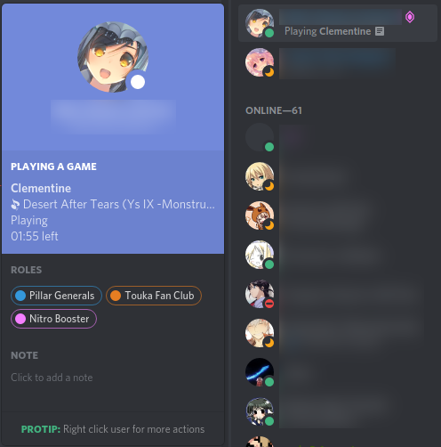

Clementine / Discord Integration
================================

This is a simple Python script that displays whatever you're listening to in the
[Clementine](https://www.clementine-player.org/) as your "Now Playing" status in 
[Discord](https://discordapp.com/).



Requirements
------------

This has been tested on Ubuntu 18.04 with Python 3.6, Clementine 1.3.1, and the standalone Discord client 0.0.9.

It requires the `pypresence` and `dbus-python` Python modules.

Usage
-----

1. Install `pypresence` and `dbus-python`, if you don't have them already
    ```bash
    pip install -r requirements.txt   
    ```
2. Start Discord
3. Start Clementine
4. Run `./clementine_discord.py`

That's all there is to it.  It will quietly run in the background and update your status in Discord every 15 seconds.

If you want to customize the exact string it puts in the details, edit the `DETAILS_STRING` variable at the top of
`clementine_discord.py`.  You can substitute in any value that is returned in Clementine's metadata, although note that
any colons (`:`) in the keys should be replaced with dashes (`-`).  You can run this command while Clementine is playing
to see a list of values:
```bash
qdbus org.mpris.MediaPlayer2.clementine \
    /org/mpris/MediaPlayer2 \
    org.freedesktop.DBus.Properties.Get \
    org.mpris.MediaPlayer2.Player \
    Metadata
```

Questions?
----------

Feel free to open an issue or if you have any success or failure stories on other platforms.